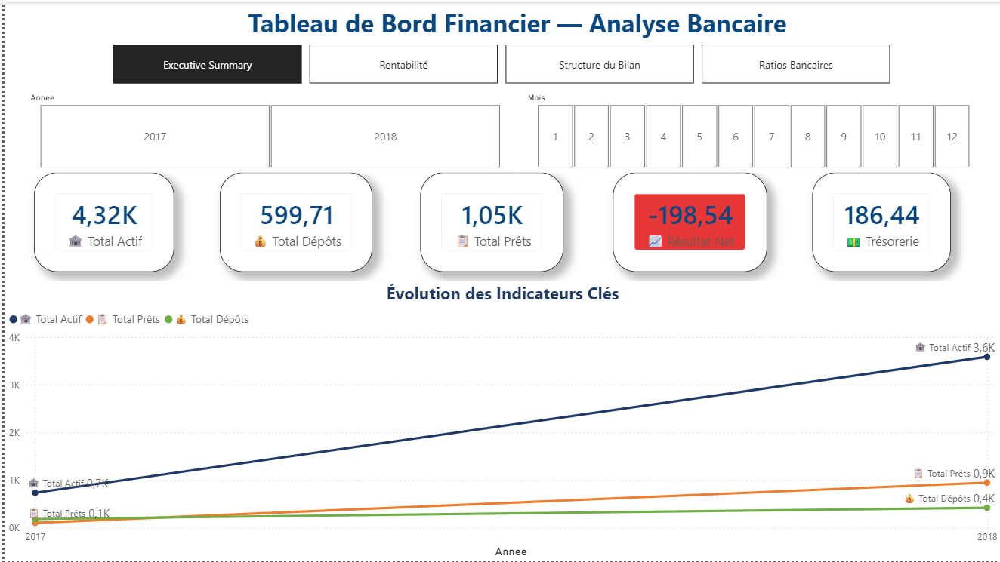
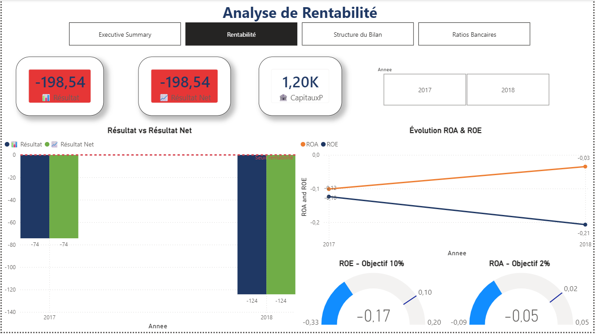
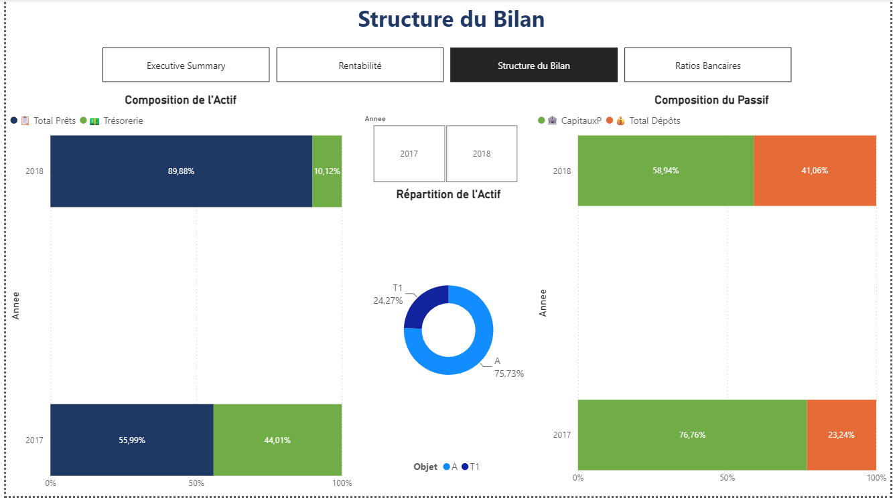
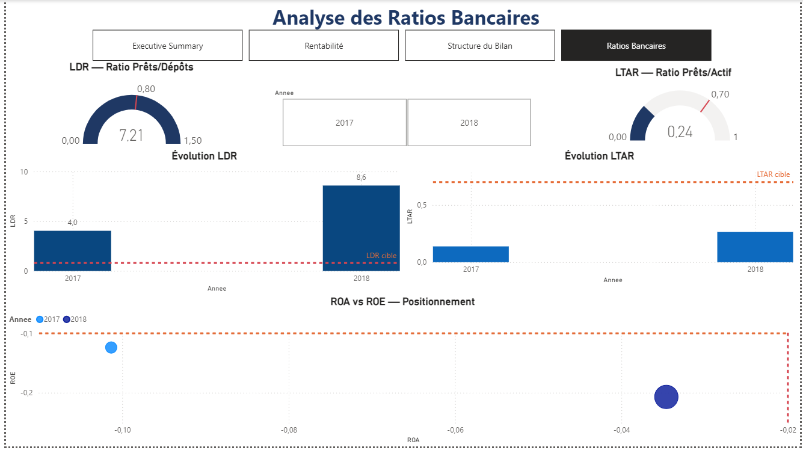

# 🏦 Tableau de Bord — Analyse Bancaire

## 📋 Description
Dashboard Power BI pour l'analyse financière complète d'une banque islamique marocaine sur les années 2017 et 2018.

## 🎯 Objectifs
- Analyser la rentabilité de la banque
- Suivre l'évolution des actifs et passifs
- Calculer les ratios bancaires clés
- Identifier les risques financiers

## 📊 Pages du Dashboard

### Page 1 Executive Summary

- 5 KPI Cards (Actif, Dépôts, Prêts, RNet, Tréso)
- Line Chart évolution indicateurs clés
- Slicers Année et Mois

### Page 2 Rentabilité

- Clustered Column Chart Résultat vs RNet
- Line Chart ROA et ROE
- Gauges ROE et ROA avec objectifs

### Page 3 Structure du Bilan

- 100% Stacked Bar Composition Actif
- 100% Stacked Bar Composition Passif
- Donut Chart Répartition Actif

### Page 4 Ratios Bancaires

- Gauge LDR avec cible 0.8
- Gauge LTAR avec cible 0.7
- Column Charts évolution ratios
- Scatter Chart ROA vs ROE

## 📈 Indicateurs Calculés

| Indicateur | Description | Formule |
|------------|-------------|---------|
| Total Actif | Total des actifs | SUMX FILTER Nature=Actif |
| Total Dépôts | Dépôts clients | SUMX FILTER Objet=T2 |
| Total Prêts | Prêts accordés | SUMX FILTER Objet=T1 |
| Résultat | Résultat brut | SUMX FILTER Objet=R |
| RNet | Résultat net | SUMX FILTER Résultat net |
| CapitauxP | Capitaux propres | SUMX FILTER C1+C2 |
| LDR | Loan Deposit Ratio | Actif/Dépôts |
| LTAR | Loan Asset Ratio | Prêts/Actif |
| ROA | Return on Assets | Résultat/Actif |
| ROE | Return on Equity | RNet/CapitauxP |
| Trésorerie | Cash disponible | SUMX FILTER T10 |

## 🔍 Conclusions Clés

| Finding | Detail |
|---------|--------|
| 🔴 Non rentable | Pertes en 2017 et 2018 |
| 🟢 Croissance forte | Total Actif multiplié par 5 |
| 🔴 LDR élevé | 7.21 vs benchmark 0.8 |
| 🟡 ROA s'améliore | De -0.10 à -0.03 |
| 🔴 ROE se dégrade | De -0.10 à -0.21 |
| 🟢 Dépôts croissent | Confiance des clients |

## 🛠️ Technologies
- Power BI Desktop
- DAX (Data Analysis Expressions)
- Power Query M

## 📁 Structure du Projet

BI-Analyse-Bancaire/
├── Projet_Banque.pbix
├── Data/
│ ├── Bilan.xlsx
│ └── Dim_date.xlsx
├── Screenshots/
│ ├── page1_executive_summary.png
│ ├── page2_rentabilite.png
│ ├── page3_structure_bilan.png
│ └── page4_ratios_bancaires.png
├── DAX/
│ └── measures_banque.md
└── README.md

## 🚀 Comment ouvrir
1. Installer Power BI Desktop (gratuit sur Microsoft Store)
2. Télécharger Projet_Banque.pbix
3. Ouvrir avec Power BI Desktop
4. Explorer les 4 pages du dashboard

## 👤 Auteur
**Yassir Bouchnaf**
Étudiant en BUISINESS AND DATA MANAGEMENT, ESITH Casablanca MANAGEMENT — ESITH Casablanca
## 📁 Structure du Projet
